# BlockOps - Complete System Workflow Diagram

This document contains comprehensive Mermaid diagrams visualizing the entire BlockOps platform architecture, data flow, and interactions.

---

## 1. High-Level System Architecture

```mermaid
graph TB
    subgraph "User Layer"
        U[👤 User Browser]
        UI[🖥️ Next.js Frontend<br/>Port: 3000]
    end
    
    subgraph "Authentication & Database"
        PRIVY[🔐 Privy Auth]
        SUPA[🗄️ Supabase Database]
    end
    
    subgraph "Backend Services"
        AI[🤖 AI Agent Backend<br/>FastAPI - Port 8000]
        BK[⚙️ Blockchain Backend<br/>Express - Port 3000]
        WF[🔄 Workflow Generator<br/>FastAPI - Port 8001]
    end
    
    subgraph "Blockchain Layer"
        ARB[🔗 Arbitrum Sepolia<br/>Chain ID: 421614]
        ETH[🔗 Ethereum Sepolia]
    end
    
    subgraph "Smart Contracts"
        TF[📝 Token Factory<br/>Stylus Contract]
        NF[🎨 NFT Factory<br/>Stylus Contract]
        PE[💰 Payment Escrow<br/>x402 Protocol]
        USDC[💵 USDC Token]
    end
    
    U -->|User Actions| UI
    UI <-->|Authentication| PRIVY
    UI <-->|Data Storage| SUPA
    UI -->|AI Chat/Generate| AI
    UI -->|Workflow Build| WF
    AI -->|Tool Execution| BK
    BK -->|Deploy/Transfer| ARB
    BK -->|Price Fetch| ETH
    ARB -->|Token Deploy| TF
    ARB -->|NFT Deploy| NF
    ARB -->|Payments| PE
    PE -->|USDC Escrow| USDC
    
    style U fill:#e1f5ff
    style UI fill:#bbdefb
    style AI fill:#fff9c4
    style BK fill:#c8e6c9
    style ARB fill:#f8bbd0
    style PE fill:#ffccbc
```



---

## 2. Complete User Journey Flow

```mermaid
flowchart TD
    START([👤 User Visits Platform]) --> AUTH{Authenticated?}
    
    AUTH -->|No| LOGIN[🔐 Login with Privy<br/>Google/Email/Wallet]
    AUTH -->|Yes| DASH[📊 Dashboard]
    
    LOGIN --> CREATE_USER[💾 Create User in DB<br/>Generate API Key]
    CREATE_USER --> WALLET_SETUP{Has Wallet?}
    
    WALLET_SETUP -->|No| CREATE_WALLET[🔑 Create Agent Wallet<br/>Store Private Key]
    WALLET_SETUP -->|Yes| IMPORT_WALLET[📥 Import Private Key]
    
    CREATE_WALLET --> DASH
    IMPORT_WALLET --> DASH
    
    DASH --> CHOICE{What to Do?}
    
    CHOICE -->|Build Manually| BUILDER[🎨 Visual Workflow Builder]
    CHOICE -->|Use AI| AI_GEN[🤖 AI Agent Generator]
    CHOICE -->|View Agents| MY_AGENTS[📋 My Agents]
    
    BUILDER --> DRAG[🖱️ Drag & Drop Tools]
    DRAG --> CONNECT[🔗 Connect Tools]
    CONNECT --> CONFIG[⚙️ Configure Parameters]
    CONFIG --> SAVE[💾 Save Agent]
    
    AI_GEN --> AI_PROMPT[💬 Describe Agent in NL]
    AI_PROMPT --> AI_PROCESS[🧠 Gemini 2.0 Processes]
    AI_PROCESS --> AI_WORKFLOW[🔄 Generate Workflow]
    AI_WORKFLOW --> SAVE
    
    SAVE --> AGENT_READY[✅ Agent Ready]
    
    MY_AGENTS --> SELECT_AGENT[🔍 Select Agent]
    SELECT_AGENT --> AGENT_READY
    
    AGENT_READY --> INTERACT{How to Interact?}
    
    INTERACT -->|UI Chat| CHAT[💬 Chat Interface]
    INTERACT -->|API| API_CALL[📡 REST API Call]
    
    CHAT --> PAYMENT_CHECK{Premium<br/>Feature?}
    API_CALL --> PAYMENT_CHECK
    
    PAYMENT_CHECK -->|Free Tier| EXECUTE[⚡ Execute Tools]
    PAYMENT_CHECK -->|Premium| PAY_MODAL[💳 Payment Modal]
    
    PAY_MODAL --> APPROVE[✅ Approve USDC]
    APPROVE --> ESCROW[🔒 Deposit to Escrow]
    ESCROW --> EXECUTE
    
    EXECUTE --> BLOCKCHAIN[⛓️ Blockchain Transaction]
    BLOCKCHAIN --> SUCCESS{Success?}
    
    SUCCESS -->|Yes| PAY_COMPLETE[💰 Execute Payment]
    SUCCESS -->|No| REFUND[↩️ Auto Refund]
    
    PAY_COMPLETE --> RESULT[📊 Show Results]
    REFUND --> ERROR[❌ Show Error]
    ERROR --> RESULT
    
    RESULT --> MORE{Continue?}
    MORE -->|Yes| INTERACT
    MORE -->|No| END([✅ Complete])
    
    style START fill:#e1f5ff
    style AUTH fill:#fff9c4
    style BUILDER fill:#c8e6c9
    style AI_GEN fill:#ffccbc
    style EXECUTE fill:#f8bbd0
    style BLOCKCHAIN fill:#ce93d8
    style PAY_COMPLETE fill:#a5d6a7
```



---

## 3. AI Chat Message Processing Flow


---

## 4. x402 Payment Flow (Premium Features)

```mermaid
sequenceDiagram
    actor User
    participant Frontend as Frontend
    participant DB as Supabase
    participant Escrow as Payment Escrow<br/>Smart Contract
    participant USDC as USDC Token
    participant Backend as Backend Service
    participant Chain as Arbitrum Sepolia
    
    User->>Frontend: Request premium feature
    
    Frontend->>DB: Check AI quota
    DB-->>Frontend: 0 free calls remaining
    
    Frontend->>User: Show Payment Modal<br/>Cost: 0.10 USDC
    
    User->>Frontend: Click "Pay & Execute"
    
    Note over Frontend: Step 1: Approve USDC
    Frontend->>USDC: approve(escrow, 0.10 USDC)
    USDC-->>Frontend: Approval confirmed
    
    Note over Frontend: Step 2: Create Agreement
    Frontend->>Escrow: createAgreement(recipient, 0.10 USDC)
    Escrow->>USDC: transferFrom(user, escrow, 0.10)
    USDC-->>Escrow: Transfer complete
    Escrow->>Escrow: Lock funds in escrow
    Escrow-->>Frontend: agreementId = 123
    
    Frontend->>DB: Store agreement<br/>{id, user, amount, status="pending"}
    
    Note over Frontend: Step 3: Generate execution token
    Frontend->>Frontend: Sign JWT with agreementId
    Frontend->>Backend: Execute tool with JWT token
    
    Backend->>Backend: Verify JWT signature
    Backend->>Chain: Execute blockchain action
    
    alt Action Successful
        Chain-->>Backend: Transaction confirmed
        Backend->>Escrow: executeAgreement(agreementId)<br/>with backend private key
        Escrow->>USDC: transfer(recipient, 0.10)
        Escrow->>Escrow: Mark agreement as executed
        Backend-->>Frontend: {success: true, result}
        Frontend->>DB: Update agreement status="executed"
        Frontend->>DB: Decrement AI quota
        Frontend->>User: ✅ Success! Transaction complete
    else Action Failed
        Chain-->>Backend: Transaction failed
        Backend->>Escrow: refundAgreement(agreementId)
        Escrow->>USDC: transfer(user, 0.10)
        Escrow->>Escrow: Mark agreement as refunded
        Backend-->>Frontend: {success: false, error}
        Frontend->>DB: Update agreement status="refunded"
        Frontend->>User: ❌ Failed. Funds refunded
    end
```



---

## 5. Workflow Builder Component Architecture

```mermaid
graph TB
    subgraph "Workflow Builder Page"
        WB[WorkflowBuilder Component]
        NL[Node Library]
        NC[Node Config Panel]
        CE[Custom Edge]
    end
    
    subgraph "Node Types"
        AN[Agent Node<br/>Start Point]
        TN[Tool Node<br/>Blockchain Actions]
    end
    
    subgraph "Available Tools"
        T1[🪙 Deploy Token]
        T2[🎨 Deploy NFT]
        T3[💸 Transfer Tokens]
        T4[🔄 Swap Tokens]
        T5[💰 Fetch Price]
        T6[📊 Wallet Analytics]
        T7[✈️ Airdrop]
        T8[🏛️ Create DAO]
        T9[📈 Yield Calculator]
        T10[🔍 Balance Check]
    end
    
    subgraph "State Management"
        RF[ReactFlow State]
        DB[Supabase Database]
    end
    
    WB --> AN
    WB --> TN
    NL --> T1 & T2 & T3 & T4 & T5
    NL --> T6 & T7 & T8 & T9 & T10
    
    AN -->|Drag & Drop| RF
    TN -->|Drag & Drop| RF
    
    RF -->|Configure| NC
    NC -->|Set Params| RF
    
    RF -->|Connect Nodes| CE
    CE -->|Visual Flow| RF
    
    WB -->|Save Agent| DB
    DB -->|Load Agent| WB
    
    style WB fill:#bbdefb
    style RF fill:#c8e6c9
    style DB fill:#ffccbc
```



---

## 6. Backend Service Routing Architecture

```mermaid
graph LR
    subgraph "Blockchain Backend (Express - Port 3000)"
        APP[app.js<br/>Main Server]
        
        subgraph "Routes"
            HR[/health]
            TR[/token]
            NR[/nft]
            XR[/transfer]
            PR[/price]
            NL[/nl-executor]
        end
        
        subgraph "Controllers"
            TC[tokenController]
            NC[nftController]
            XC[transferController]
            PC[priceController]
            NLC[nlExecutorController]
        end
        
        subgraph "Utils"
            BC[blockchain.js<br/>Web3 Connection]
            HE[helpers.js<br/>Data Formatting]
        end
        
        subgraph "Config"
            ABI[abis.js<br/>Contract ABIs]
            CON[constants.js<br/>Addresses & RPC]
        end
    end
    
    APP --> HR & TR & NR & XR & PR & NL
    
    TR --> TC
    NR --> NC
    XR --> XC
    PR --> PC
    NL --> NLC
    
    TC & NC & XC --> BC
    TC & NC & XC & PC --> HE
    
    BC --> ABI
    BC --> CON
    
    style APP fill:#81c784
    style BC fill:#64b5f6
    style TC fill:#ffb74d
    style NC fill:#ff8a65
```

---

## 7. AI Agent Backend Tool Execution Flow

```mermaid
flowchart TD
    START[🚀 Receive /agent/chat Request] --> PARSE[📝 Parse Request]
    
    PARSE --> EXTRACT[🔍 Extract:<br/>• tools<br/>• user_message<br/>• private_key]
    
    EXTRACT --> BUILD_PROMPT[🧠 Build Gemini Prompt]
    
    BUILD_PROMPT --> TOOL_LIST[📋 List Available Tools:<br/>• transfer<br/>• deploy_erc20<br/>• deploy_nft<br/>• swap<br/>• price<br/>• balance<br/>• airdrop<br/>• dao<br/>• yield<br/>• analytics]
    
    TOOL_LIST --> GEMINI[🤖 Send to Gemini 2.0 Flash]
    
    GEMINI --> AI_RESPONSE[💡 AI Response]
    
    AI_RESPONSE --> CHECK{Tool<br/>Required?}
    
    CHECK -->|No| RESPOND[💬 Return text response]
    
    CHECK -->|Yes| IDENTIFY[🎯 Identify Tool & Params]
    
    IDENTIFY --> ADD_KEY{Private Key<br/>Needed?}
    
    ADD_KEY -->|Yes| INSERT_KEY[🔑 Add private_key to params]
    ADD_KEY -->|No| PREPARE
    
    INSERT_KEY --> PREPARE[📦 Prepare API Call]
    
    PREPARE --> EXECUTE[⚡ Execute Tool]
    
    EXECUTE --> CALL_MAP{Tool Type}
    
    CALL_MAP -->|transfer| BE1[POST /transfer]
    CALL_MAP -->|deploy_erc20| BE2[POST /token/deploy]
    CALL_MAP -->|deploy_nft| BE3[POST /nft/deploy-collection]
    CALL_MAP -->|mint_nft| BE4[POST /nft/mint]
    CALL_MAP -->|swap| BE5[POST /swap]
    CALL_MAP -->|price| BE6[GET /price]
    CALL_MAP -->|balance| BE7[GET /transfer/balance]
    
    BE1 & BE2 & BE3 & BE4 & BE5 & BE6 & BE7 --> BACKEND[🔗 Blockchain Backend<br/>Port 3000]
    
    BACKEND --> RESULT{Success?}
    
    RESULT -->|Yes| FORMAT[✅ Format Success Response]
    RESULT -->|No| ERROR[❌ Format Error Response]
    
    FORMAT --> RESPOND
    ERROR --> RESPOND
    
    RESPOND --> END[📤 Return to Frontend]
    
    style START fill:#e1f5ff
    style GEMINI fill:#fff9c4
    style EXECUTE fill:#c8e6c9
    style BACKEND fill:#ffccbc
    style FORMAT fill:#a5d6a7
    style ERROR fill:#ef9a9a
```



---

## 8. Database Schema & Relationships


---

## 9. Smart Contract Deployment Architecture


---

## 10. Environment Configuration Flow


---

## 11. Docker Compose Service Architecture


---

## 12. Complete API Endpoint Map


---

## 13. Security & Authentication Flow


---

## 14. Error Handling & Retry Logic

```mermaid
flowchart TD
    START[User Action] --> FRONTEND[Frontend Request]
    
    FRONTEND --> TRY1[Attempt 1]
    
    TRY1 --> CHECK1{Success?}
    
    CHECK1 -->|Yes| SUCCESS[✅ Complete]
    CHECK1 -->|No| ERROR1[⚠️ Error Type?]
    
    ERROR1 --> TYPE1{Error Category}
    
    TYPE1 -->|Network| RETRY1[Wait 1s + Retry]
    TYPE1 -->|Gas| GAS_FIX[Increase Gas Limit]
    TYPE1 -->|Nonce| NONCE_FIX[Refresh Nonce]
    TYPE1 -->|Insufficient Funds| FUND_ERROR[❌ Show Balance Error]
    TYPE1 -->|Contract Revert| CONTRACT_ERROR[❌ Show Revert Reason]
    
    RETRY1 --> TRY2[Attempt 2]
    GAS_FIX --> TRY2
    NONCE_FIX --> TRY2
    
    TRY2 --> CHECK2{Success?}
    
    CHECK2 -->|Yes| SUCCESS
    CHECK2 -->|No| ERROR2[⚠️ Still Failing]
    
    ERROR2 --> TYPE2{Retry Count}
    
    TYPE2 -->|< 3| RETRY2[Wait 2s + Retry]
    TYPE2 -->|>= 3| FAIL[❌ Final Failure]
    
    RETRY2 --> TRY3[Attempt 3]
    TRY3 --> CHECK3{Success?}
    
    CHECK3 -->|Yes| SUCCESS
    CHECK3 -->|No| FAIL
    
    FUND_ERROR --> LOG[📝 Log Error]
    CONTRACT_ERROR --> LOG
    FAIL --> LOG
    
    LOG --> REFUND{Payment<br/>Involved?}
    
    REFUND -->|Yes| AUTO_REFUND[♻️ Auto Refund via Escrow]
    REFUND -->|No| NOTIFY[📧 Notify User]
    
    AUTO_REFUND --> NOTIFY
    NOTIFY --> END[🏁 End]
    SUCCESS --> END
    
    style SUCCESS fill:#a5d6a7
    style FAIL fill:#ef9a9a
    style AUTO_REFUND fill:#fff59d
```



---

## 15. Development & Deployment Pipeline

```mermaid
graph LR
    subgraph "Development"
        DEV[👨‍💻 Local Development]
        TEST[🧪 Testing]
        GIT[📦 Git Commit]
    end
    
    subgraph "Version Control"
        GITHUB[GitHub Repository<br/>main branch]
    end
    
    subgraph "CI/CD"
        VERCEL[▲ Vercel<br/>Auto Deploy]
        DOCKER[🐳 Docker Build]
    end
    
    subgraph "Production"
        FRONT_PROD[🌐 Frontend<br/>Vercel Hosting]
        BACK_PROD[⚙️ Backend Services<br/>Docker Containers]
    end
    
    subgraph "Blockchain"
        CONTRACTS[📝 Smart Contracts<br/>Arbitrum Sepolia]
    end
    
    DEV --> TEST
    TEST --> GIT
    GIT --> GITHUB
    
    GITHUB -->|Push to main| VERCEL
    GITHUB -->|Manual deploy| DOCKER
    
    VERCEL --> FRONT_PROD
    DOCKER --> BACK_PROD
    
    FRONT_PROD <--> BACK_PROD
    BACK_PROD <--> CONTRACTS
    
    style DEV fill:#bbdefb
    style VERCEL fill:#00bcd4
    style FRONT_PROD fill:#4caf50
    style CONTRACTS fill:#f44336
```



---

## Summary

This comprehensive workflow diagram covers:

1. **High-Level Architecture** - Overall system components and connections
2. **User Journey** - Complete user interaction flow
3. **AI Processing** - How natural language is converted to blockchain actions
4. **Payment System** - x402 protocol payment flow
5. **Component Architecture** - Frontend builder structure
6. **Backend Routing** - API endpoint organization
7. **Tool Execution** - AI agent backend processing
8. **Database Schema** - Data relationships
9. **Smart Contracts** - Deployment and usage
10. **Configuration** - Environment variables
11. **Docker Services** - Container architecture
12. **API Endpoints** - Complete endpoint map
13. **Security** - Authentication and authorization
14. **Error Handling** - Retry logic and failure recovery
15. **Deployment** - Development to production pipeline

Each diagram can be rendered using any Mermaid-compatible tool or viewer.
